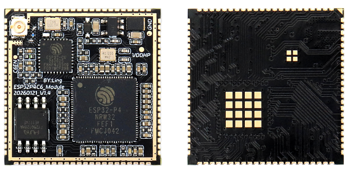
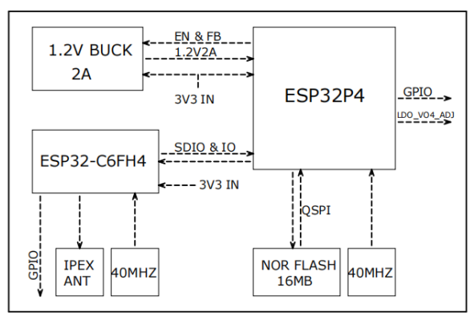
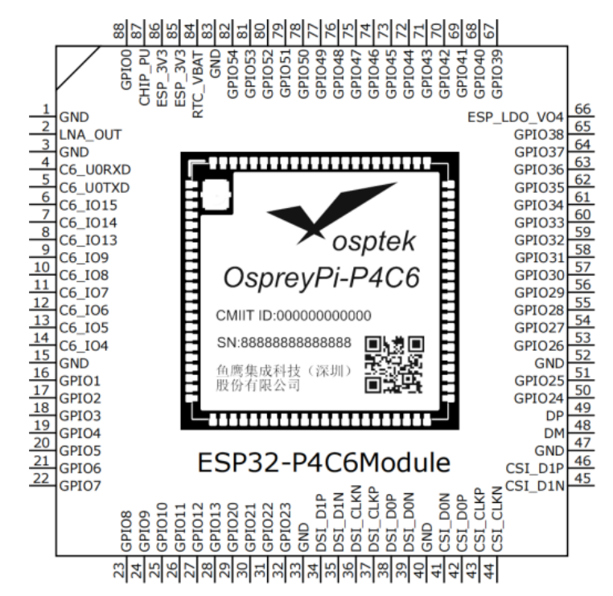
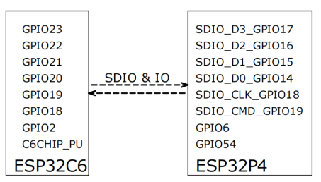
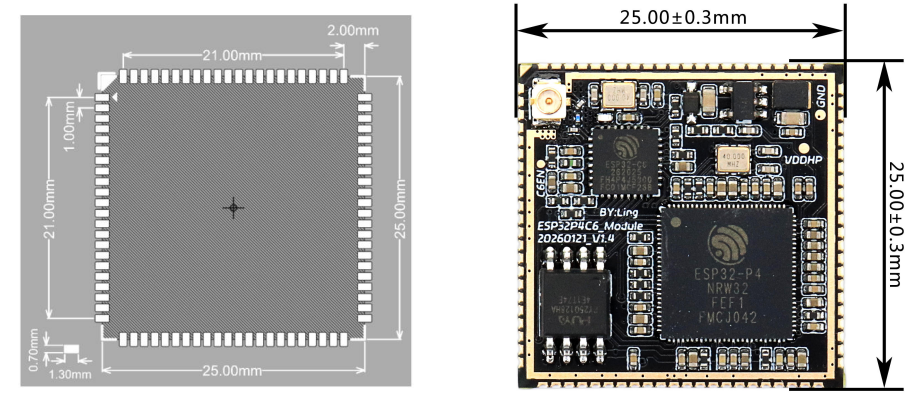
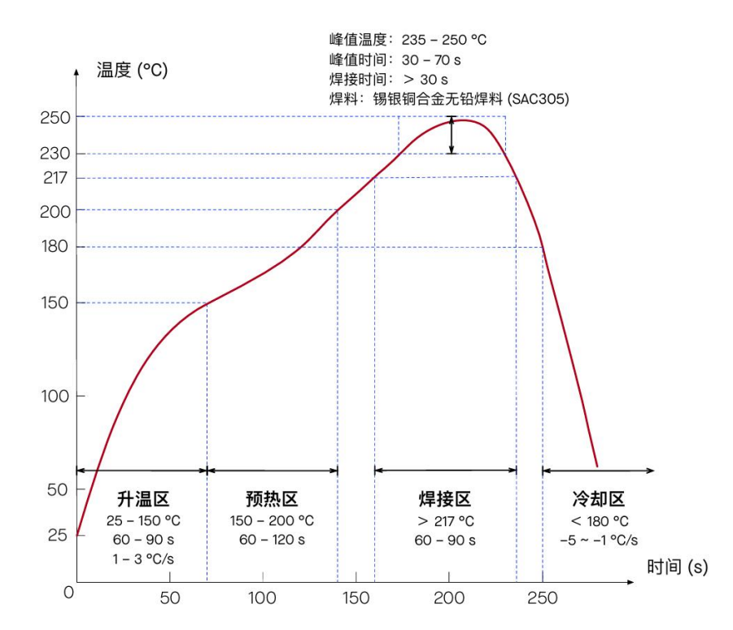
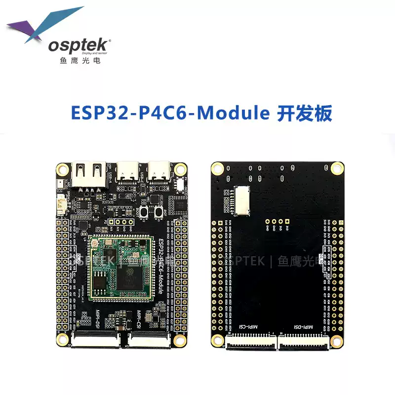
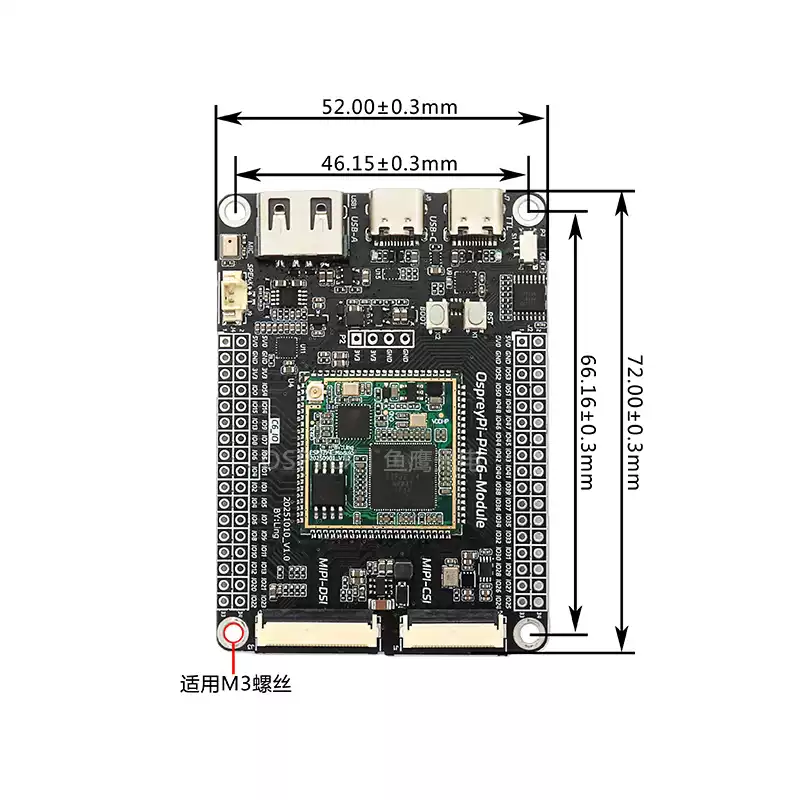

<p align="left"></p>

<h1 align="center">OSPTEK ESP32-P4C6 Core Board</h1>

<p align="center"><b>High-Performance RISC-V Dual-Core · Powerful Image & Multimedia Processing · Compact Stamp-Hole Core Board</b></p>

<p align="center">English | <a href="./README.md">简体中文</a></p>

<p align="center">
  
  
  
  
  
  
</p>

<p align="center"></p>

## Contents

- [Overview](#overview)
- [Features](#features)
- [Applications](#applications)
- [Specifications](#specifications)
- [Hardware Resources](#hardware-resources)
- [Carrier Board](#carrier-board)
- [Repository Structure](#repository-structure)
- [Documentation](#documentation)
- [Where to Buy](#where-to-buy)
- [Support](#support)

---

## Overview

> 📌 The specifications below are based on the **ESP32-P4 chip revision v1.3**.

The OSPTEK ESP32-P4C6 Core Board (ESP32-P4C6-Core) is a compact stamp-hole core board based on Espressif's ESP32-P4. It features 16 MB onboard NOR Flash and 32 MB PSRAM (in-package stacked with the P4), and integrates an **ESP32-C6FH4** for wireless connectivity (onboard IPEX-1 antenna connector).

The ESP32-P4 main controller integrates two high-performance (HP) RISC-V cores and one low-power (LP) core, running at up to 360 MHz. It includes a JPEG codec, Pixel Processing Accelerator (PPA), H.264 video encoder, Image Signal Processor (ISP) and MIPI interfaces, delivering powerful image and multimedia processing capability.

Specifications and pinout are governed by the [ESP32-P4C6-Core User Guide (EN)](./docs/ESP32-P4C6-Core_User%20Guide%20260413.pdf).

---

## Features

- ⚡ **High-Performance Dual-Core**: ESP32-P4 dual-core RISC-V processor, up to 360 MHz
- 💾 **Ample Memory**: 16 MB Flash + 32 MB PSRAM onboard for large applications
- 🎨 **Rich Multimedia**: JPEG codec, H.264 video encoding, PPA, ISP and MIPI interfaces for image & video processing
- 📶 **Wireless Connectivity**: onboard ESP32-C6FH4 with IPEX-1 antenna connector
- 🔌 **Full Pin Breakout**: all ESP32-P4 pins exposed for flexible peripheral use
- 📐 **Compact & Integrable**: 25 × 25 mm stamp-hole package, easy to integrate onto your own carrier board
- 🛠️ **Complete Dev Resources**: user guides and pin definitions, built on the official ESP-IDF ecosystem

---

## Applications

- 🏠 Smart home
- 🏭 Industrial automation
- 📱 Consumer electronics
- 🖥️ HMI (human-machine interface)
- 🤖 Robotics
- 📷 Camera video streaming
- 🔌 USB devices

---

## Specifications

### MCU & Memory

| Item      | Specification                              |
| --------- | ------------------------------------------ |
| Main Chip | Espressif ESP32-P4                         |
| CPU Cores | RISC-V 32-bit dual-core (HP) + single-core (LP) |
| Clock     | HP 360 MHz / LP 40 MHz                     |
| ROM       | 128 KB (HP) + 16 KB (LP)                   |
| SRAM      | 768 KB L2MEM (HP) + 32 KB (LP)            |
| Flash     | 16 MB (onboard NOR Flash)                  |
| PSRAM     | 32 MB (in-package)                         |

### Wireless

| Item          | Specification                         |
| ------------- | ------------------------------------- |
| Wireless Chip | ESP32-C6FH4                           |
| Antenna       | Onboard IPEX-1 antenna connector (LAN_OUT) |

> Wireless protocol capabilities follow the Espressif ESP32-C6 datasheet.

### Peripherals

| Interface      | Qty  | Interface                      | Qty  |
| -------------- | ---- | ------------------------------ | ---- |
| GPIO           | 55   | I2S / LP I2S                   | 3 / 1 |
| SPI / LP SPI   | 2 / 1 | USB Serial/JTAG                | 1    |
| UART / LP UART | 5 / 1 | High-Speed USB 2.0 OTG         | 1    |
| I2C / LP I2C   | 2 / 1 | Full-Speed USB 2.0 OTG         | 1    |
| I3C            | 1    | SDIO                           | 1    |
| MIPI CSI-2     | 1    | 100 Mbps Ethernet MAC          | 1    |
| MIPI DSI       | 1    | TWAI (ISO 11898-1 compatible)  | 3    |
| PARLIO         | 1    | LED PWM / MCPWM                | 1 / 2 |

### Image & Multimedia

- JPEG codec ×1
- Pixel Processing Accelerator (PPA) ×1
- Image Signal Processor (ISP) ×1
- H.264 video encoder ×1

### Analog & Sensor

- 12-bit multi-channel ADC ×2
- Temperature sensor ×1
- Touch sensor ×1
- Analog comparator ×1
- Brown-out detector ×1

### Electrical

| Item               | Min  | Typ  | Max  | Unit |
| ------------------ | ---- | ---- | ---- | ---- |
| Supply Voltage VCC | 3.0  | 3.3  | 3.6  | V    |
| Supply Current     | —    | 1    | —    | A    |
| Operating Temp.    | -40  | —    | 85   | °C   |

---

## Hardware Resources

### Onboard Components

| Component        | Description                              |
| ---------------- | ---------------------------------------- |
| Main Controller  | Espressif ESP32-P4                       |
| Wireless         | ESP32-C6FH4                              |
| Flash            | 16 MB (onboard NOR Flash)                |
| PSRAM            | 32 MB (in-package with ESP32-P4)         |
| Antenna          | Onboard IPEX-1 antenna connector (LAN_OUT) |
| Package          | Compact stamp-hole, 88 pins total        |

### Block Diagram

<p align="center"></p>

### Pinout

<p align="center"></p>

### Pin Definitions

The core board has **88 pins** (stamp-hole) in total. See the full 👉 **[Pin Definition Table](./pages/pin-definition_EN.md)**

### Internal Connection (ESP32-C6 ↔ ESP32-P4)

ESP32-C6 and ESP32-P4 communicate via **SDIO + IO**. The connection is shown below:

<p align="center"></p>

### Dimensions

<p align="center"></p>

Module dimensions: **25.00 × 25.00 mm** (±0.15 mm).

### Reflow Profile

<p align="center"></p>

> Solder: SAC305 lead-free solder; peak temperature 235–250 °C, peak time 30–70 s.

### Storage Conditions

| Item                          | Parameter                                             |
| ----------------------------- | ---------------------------------------------------- |
| Moisture Sensitivity (MSL)    | Level 3                                              |
| Storage                       | In sealed MBB, &lt; 40 °C / 90%RH, non-condensing       |
| After opening                 | Use within 168 hours at 25 ± 5 °C / 60%RH            |

---

## Carrier Board

The matching development board for this core board is the **ESP32-P4C6-Module Dev Board**
(`esp32-p4c6-module-dev-board`), featuring USB, MIPI-CSI / MIPI-DSI and other interfaces, with all
core-board pins broken out for rapid evaluation and secondary development.

<table align="center">
  <tr>
    <td align="center"></td>
    <td align="center"></td>
  </tr>
</table>

Dedicated dev-board repository (🚧 under construction; links to be updated after the repo is created):

- GitHub: <https://github.com/osptek/esp32-p4c6-module-dev-board>
- Gitee: <https://gitee.com/osptek/esp32-p4c6-module-dev-board>

---

## Repository Structure

```text
esp32-p4c6-core-board/
├── README.md          # Product documentation (Chinese)
├── README_EN.md       # Product documentation (English, this file)
├── docs/              # user guides, footprint libraries, antenna docs
├── images/            # Images used in README & docs
└── pages/             # Detailed sub-documents
    ├── 引脚定义.md            # Full 88-pin definition table (Chinese)
    └── pin-definition_EN.md   # Full 88-pin definition table (English)
```

---

## Documentation

### This Product

- [ESP32-P4C6-Core Core Board User Guide (EN)](./docs/ESP32-P4C6-Core_User%20Guide%20260413.pdf)
- [ESP32-P4C6-Core 核心板使用指南 (CN)](./docs/ESP32-P4C6-Core%E6%A0%B8%E5%BF%83%E6%9D%BF_%E4%BD%BF%E7%94%A8%E6%8C%87%E5%8D%97260413.pdf)
- [ESP32P4C6 module footprint library (SchLib)](./docs/ESP32P4C6%E6%A8%A1%E7%BB%84%E5%B0%81%E8%A3%85.SchLib)
- [ESP32P4C6 module footprint library (PcbLib)](./docs/ESP32P4C6%E6%A8%A1%E7%BB%84%E5%B0%81%E8%A3%85.PcbLib)
- [C6 2.4G antenna documentation](./docs/C6%202.4G%E5%A4%A9%E7%BA%BF.pdf)

### Chip Documentation (Espressif)

- [ESP32-P4 Datasheet v1.3](https://documentation.espressif.com/esp32-p4-chip-revision-v1.3_datasheet_en.html)
- [ESP32-P4 Technical Reference Manual v1.3](https://documentation.espressif.com/esp32-p4-chip-revision-v1.3_technical_reference_manual_en.pdf)
- [ESP32-P4 Product Page](https://www.espressif.com/en/producttype/esp32-p4)
- [ESP32-C6 Datasheet](https://documentation.espressif.com/esp32-c6_datasheet_en.html)
- [ESP32-C6 Product Page](https://www.espressif.com/en/products/socs/esp32-c6)

### Development Guides

- [ESP-IDF Programming Guide · ESP32-P4](https://docs.espressif.com/projects/esp-idf/en/latest/esp32p4/index.html)
- [ESP-IDF Get Started · ESP32-P4](https://docs.espressif.com/projects/esp-idf/en/latest/esp32p4/get-started/)

---

## Where to Buy

<p align="center">
  <a href="https://www.aliexpress.com/store/1105701619"></a>
  &nbsp;&nbsp;
  <a href="https://shop110742373.taobao.com/"></a>
</p>

**International (AliExpress)**

- Store: [OSPTEK Official Store](https://www.aliexpress.com/store/1105701619)

**China (Taobao)**

- Store: [鱼鹰光电工厂店](https://shop110742373.taobao.com/)

---

## Support

For technical questions or business inquiries, feel free to contact us:

- 📧 Technical Support / Sales: <luyu@osptek.com>
- 🐧 QQ Technical Group: **985881096**
- 🌐 Website: <https://osptek.com/>
- Feel free to open an Issue in this repository if you have any questions

---

<p align="center"><sub>© 2026 OSPTEK · Licensed under CC BY 4.0</sub></p>
